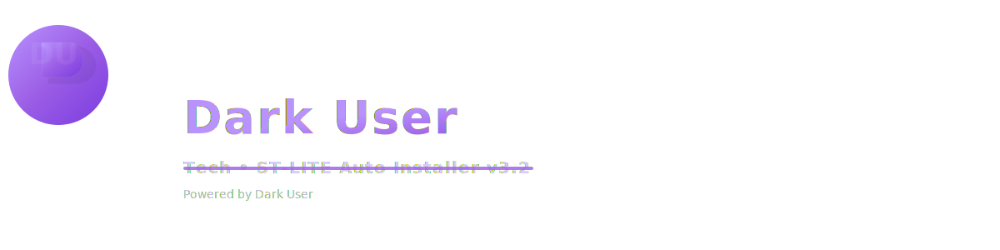

<p align="center">
  
</p>

<h1 align="center">⚡ ST-LITE Auto Installer v3.2 ⚡</h1>
<p align="center">
  <b><span style="color:#9b5de5">Dark User</span> presents an all-in-one auto installer</b><br>
  for SSH • SSL • UDP • V2Ray • Cloudflare • Telegram Bot
</p>

---

### 💜 Fitur Utama
✅ **Auto Install Lengkap** — SSH, SSL, UDP, dan V2Ray dalam satu perintah.  
✅ **Auto Domain + SSL (Cloudflare)** — Integrasi penuh API Cloudflare.  
✅ **Neon SSH Banner** — Tampilan ungu animasi khas DarkUser.  
✅ **Error-Proof System** — Semua error otomatis diperbaiki & tercatat.  
✅ **Auto Update System** — Cukup jalankan `bash /root/st-lite/update.sh`.  
✅ **Telegram Webhook Bot** — Kirim notifikasi otomatis ke Telegram.  

---

### ⚙️ Instalasi Cepat
#### 1️⃣ Clone Repository
```bash
git clone https://github.com/karisnacell69/st-lite.git
cd st-lite


# ST-LITE Auto Installer v3.2 (Dark User)
Installer otomatis dengan fitur:
- Auto Domain + SSL (Cloudflare)
- SSH + SSL + UDP + V2Ray Multiport
- Telegram Bot Webhook
- Animated Neon SSH Banner
- Error-Proof Logging + Auto Update
